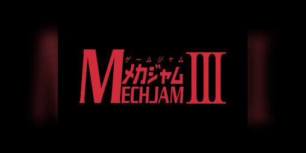

The Untitled Mech Game is a 2d platformer puzzle game that I helped develop for a game jam called the Mech Jam. I completed this project as part of a team of students in the UH Manoa Game Dev club. We placed 29th overall in the competition.

Source: <a href="https://bencatcraw.itch.io/untitled-mech-game">bencratcraw.itch.io/untitled-mech-game</a>
